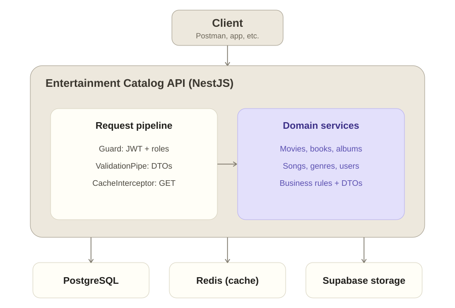

# 🎬 Entertainment Catalog API


A RESTful API for managing an entertainment catalog (movies, books, albums, and songs), built with NestJS and designed to serve multimedia content to presentation applications.

It ships with JWT authentication and role-based authorization, Redis caching with targeted invalidation, cover image storage on Supabase, soft deletes, database migrations, and a CI/CD pipeline that tests against real Postgres and Redis instances before publishing a multi-architecture Docker image.

## 🏗 Architecture



## 📋 Table of Contents

- [Features](#-features)
- [Tech Stack](#-tech-stack)
- [Architecture](#-architecture)
- [Data Model](#-data-model)
- [Authentication and Authorization](#-authentication-and-authorization)
- [Prerequisites](#-prerequisites)
- [Installation](#-installation)
- [Configuration](#-configuration)
- [Usage](#-usage)
- [API Endpoints](#-api-endpoints)
- [Documentation](#-documentation)
- [Docker](#-docker)
- [CI/CD](#-cicd)
- [Available Scripts](#-available-scripts)
- [Testing](#-testing)
- [Contributing](#-contributing)
- [Roadmap](#-roadmap)
- [License](#-license)

## ✨ Features

### Main Functionalities

- **Complete CRUD**: Create, read, update, and delete operations for movies, books, albums, songs, and genres
- **JWT Authentication**: Registration and login with `bcrypt` password hashing, issued tokens validated through a Passport JWT strategy
- **Role-Based Authorization**: `admin` and `user` roles enforced by a guard, applied through a single `@Auth(...roles)` decorator
- **Soft Delete and Reactivation**: Records are deactivated (`active = false`) instead of being physically removed, and can be restored through a dedicated endpoint
- **File Management**: Cover image upload, retrieval, replacement, and deletion backed by Supabase Storage
- **Cache System**: Redis-backed caching with per-module namespaces and targeted invalidation on every write
- **Pagination**: Page-based pagination on all listing endpoints
- **Multi-Layer Validation**: Environment variables validated with `zod` at boot time, request payloads with `class-validator`, and uploaded files with a custom pipe
- **Interactive Documentation**: Fully annotated Swagger/OpenAPI specification
- **Database Migrations**: Schema versioned through TypeORM migrations, with `synchronize` disabled in production
- **Seed Data**: Admin-only endpoint that populates the database with sample records and their cover images
- **HTTP Logging**: Custom middleware that logs every incoming request

### Advanced Technical Features

- **Transactional Consistency Between Database and Storage**: Writes that involve a file run inside a `SERIALIZABLE` transaction wrapped by `CommonService.handleTransactionWithFile`, which deletes the already-uploaded object from the bucket if the transaction fails — preventing orphaned files
- **Storage Provider Abstraction**: Domain services depend on the `IStorageService` interface injected through the `STORAGE_SERVICE` token, never on Supabase directly, so the provider can be swapped without touching business logic
- **Namespaced Cache Keys**: The `CacheKey` / `EntertainmentStorage` abstract classes give each module its own cache namespace and storage folder, derived from a single path constant
- **Duplicate Detection**: Domain-level uniqueness checks (for example, title + director + studio for movies) that raise a `409 Conflict` instead of relying on database errors
- **Input Sanitization**: Custom `@CleanInput()` decorator that normalizes and cleans incoming strings before validation
- **Error Handling**: Exception filters that translate TypeORM (`QueryFailedError`, `UpdateValuesMissingError`) and Supabase Storage errors into meaningful HTTP responses
- **Serialization**: Explicit control over exposed fields with `class-transformer` — entities are `@Exclude()` by default and opt in through `@Expose()`, so sensitive columns such as `password` never leave the API
- **Global Cache Interceptor**: `CacheInterceptor` registered application-wide for automatic response caching
- **Custom Pipes**: File validation with configurable size limit (5 MB by default) and MIME type allowlist
- **TypeORM Relations**: Album ↔ songs, song ↔ genre, and eager one-to-one relations to cover metadata

## 🛠 Tech Stack

### Backend

- **Framework**: [NestJS 11](https://nestjs.com/)
- **Language**: [TypeScript 5.7](https://www.typescriptlang.org/)
- **Runtime**: Node.js 22.16.0

### Data

- **Database**: PostgreSQL 16.2
- **ORM**: [TypeORM 0.3](https://typeorm.io/) with migrations
- **Cache**: Redis 8.6 via `@nestjs/cache-manager` and `@keyv/redis` (3-minute default TTL)
- **File Storage**: [Supabase Storage](https://supabase.com/storage)

### Security

- **Authentication**: `@nestjs/jwt` with Passport (`passport-jwt`, `passport-local`)
- **Password Hashing**: `bcrypt`
- **Authorization**: Custom role guard driven by route metadata

### Validation and Serialization

- **Request Validation**: `class-validator` with `whitelist` and `forbidNonWhitelisted` enabled globally
- **Transformation**: `class-transformer`
- **Environment Validation**: `zod`

### Documentation

- **API Docs**: `@nestjs/swagger` (OpenAPI 3)

### Testing

- **Framework**: [Jest 30](https://jestjs.io/) with `ts-jest`
- **HTTP Assertions**: `supertest`

### DevOps

- **Containerization**: Docker (multi-stage) and Docker Compose
- **CI/CD**: GitHub Actions with automatic semantic versioning and multi-arch image publishing
- **Package Manager**: [pnpm](https://pnpm.io/) 10.28.2

## 🏗 Architecture

The project follows a modular architecture, with each domain isolated in its own NestJS module and cross-cutting concerns extracted into a shared module.

```
src/
├── albums/           # Albums module
├── auth/             # Authentication and authorization
│   ├── decorator/    # @Auth() and @Public() decorators
│   ├── guards/       # JWT + roles guard
│   └── strategies/   # Passport JWT strategy
├── books/            # Books module
├── movies/           # Movies module
├── songs/            # Songs module
├── genres/           # Genres module
├── user/             # User management
├── files/            # Cover storage module
│   ├── filters/      # Storage API exception filter
│   └── pipes/        # File validation pipe
├── common/           # Shared building blocks
│   ├── abstracts/    # CacheKey, EntertainmentStorage
│   ├── decorators/   # @CleanInput()
│   ├── dto/          # PaginationDto
│   ├── filters/      # TypeORM exception filters
│   ├── helpers/      # Hashing, capitalization, storage paths
│   ├── interfaces/   # IStorageService contract
│   ├── middleware/   # HTTP logger
│   └── utils/        # Validation messages, regular expressions
├── config/           # Environment, database, TypeORM, and cache configuration
├── database/
│   └── migrations/   # TypeORM migrations
└── seed/             # Sample data and loading helpers
```

Each domain module follows the same pattern:

```
module/
├── dto/              # Data Transfer Objects
├── entities/         # TypeORM entities
├── types/            # Constants, interfaces, and enums
├── module.controller.ts
├── module.service.ts
└── module.module.ts
```

### Key Design Decisions

**Storage is inverted, not imported.** `SupabaseService` implements `IStorageService` and is registered under the `STORAGE_SERVICE` token. `MoviesService`, `BooksService`, and the rest receive the interface, so replacing Supabase with S3 means writing one new provider and changing one module registration.

**Cache namespaces come from the same constant as the route.** Every entertainment service extends `EntertainmentStorage`, which builds both the cache key (`/api/movies`) and the storage folder from the module's path constant. Writes evict the collection key and the affected item key, rather than flushing the whole cache.

**File uploads are compensated, not assumed.** The upload happens before the transaction, and `handleTransactionWithFile` removes the object if the transaction rolls back. This keeps the bucket and the database from drifting apart.

## 🗃 Data Model

| Entity    | Table    | Key fields                                                                          | Relations                                    |
| --------- | -------- | ----------------------------------------------------------------------------------- | -------------------------------------------- |
| **User**  | `user`   | `email`, `username` (unique), `password`, `rol`, `verified`, `active`               | —                                            |
| **Movie** | `movies` | `title`, `director`, `writer`, `studio`, `protagonist`, `releaseDate`, `soundtrack` | One-to-one → `Cover` (`poster_id`)           |
| **Book**  | `books`  | `title`, `author`, `coWriter`, `publisher`, `releaseDate`, `createdAt`              | One-to-one → `Cover` (`cover_id`)            |
| **Album** | `albums` | `album` (unique), `artist`, `studio`, `releaseDate`                                 | One-to-many → `Song`, one-to-one → `Cover`   |
| **Song**  | `songs`  | `title`, `composer`, `guestArtist`                                                  | Many-to-one → `Album`, many-to-one → `Genre` |
| **Genre** | `genres` | `genre` (unique)                                                                    | One-to-many → `Song`                         |
| **Cover** | `covers` | `file` (storage path)                                                               | Inverse side of movie, book, and album       |

All catalog entities carry an `active` flag used for soft deletes. Cover relations are `eager` and use `cascade`, so a record's cover metadata travels with it.

## 🔐 Authentication and Authorization

Authorization is declarative and closed by default: a controller decorated with `@Auth()` requires a valid JWT for every route, and individual routes opt out with `@Public()`.

```ts
@Controller(MOVIES_PATH)
@Auth() // every route below requires a valid token
export class MoviesController {
  @Get()
  @Public() // ...except this one
  findAll(@Query() paginationDto: PaginationDto) {
    /* ... */
  }
}
```

Passing roles restricts access further. `@Auth(Roles.ADMIN)` rejects authenticated users without the `admin` role with a `403 Forbidden`:

```ts
@Controller('files')
@Auth(Roles.ADMIN)
export class FilesController {
  /* ... */
}
```

### Getting a Token

```bash
# Register
curl -X POST http://localhost:3000/api/auth/register \
  -H "Content-Type: application/json" \
  -d '{"email":"user@example.com","username":"myuser","password":"MyPassw0rd!"}'

# Log in
curl -X POST http://localhost:3000/api/auth/login \
  -H "Content-Type: application/json" \
  -d '{"email":"user@example.com","password":"MyPassw0rd!"}'
```

Both endpoints return the user object and an `access_token`. Send it as a bearer token on protected routes:

```bash
curl -X DELETE http://localhost:3000/api/movies/<uuid> \
  -H "Authorization: Bearer <access_token>"
```

> **Note**: New users are created with the `user` role. Admin-only routes (`/api/files`, `/api/seed`) require promoting a user to `admin` directly in the database.

## 📋 Prerequisites

- **Node.js 22.16.0** (see `.node-version`)
- **pnpm 10.28.2** or later
- **PostgreSQL 16** and **Redis 8** — or Docker and Docker Compose to run both
- **Supabase account** with a storage bucket, for cover images

## 🚀 Installation

### Option 1: Local Installation

1. **Clone the repository**

```bash
git clone https://github.com/Lysander-PR/entertainment-catalog.git
cd entertainment-catalog
```

2. **Install dependencies**

```bash
pnpm install
```

3. **Configure environment variables** (see [Configuration](#-configuration))

4. **Start PostgreSQL and Redis**

```bash
docker compose up -d
```

5. **Start the application**

```bash
pnpm run start:dev
```

In development, `synchronize` is enabled, so the schema is created automatically from the entities. For a production-like setup, run the migrations instead:

```bash
pnpm run migration:run
```

### Option 2: With Docker Compose (Production)

```bash
docker compose -f docker-compose.prod.yaml up -d
```

## ⚙ Configuration

### Environment Variables

Copy `.env.template` to `.env` and fill in every value. All of them are **required** — `src/config/envs.ts` validates them with `zod` at startup and the application refuses to boot if any is missing or malformed.

```env
# Application
PORT=3000
NODE_ENV=development

# Database
DB_HOST=localhost
DB_PORT=5432
DB_USER=postgres
DB_PASSWORD=your_secure_password
DB_NAME=entertainments_db

# Supabase Storage
SUPABASE_URL=https://your-project.supabase.co
SUPABASE_KEY=your_supabase_anon_key
SUPABASE_BUCKET=entertainments-covers

# Redis Cache
REDIS_URL=redis://localhost:6379

# Authentication
JWT_SECRET=your_long_random_secret
```

| Variable          | Type   | Description                                                                 |
| ----------------- | ------ | --------------------------------------------------------------------------- |
| `PORT`            | number | Port the API listens on                                                     |
| `NODE_ENV`        | string | Set to `prod` to enable SSL, disable `synchronize`, and skip `.env` loading |
| `DB_HOST`         | string | PostgreSQL host                                                             |
| `DB_PORT`         | number | PostgreSQL port                                                             |
| `DB_USER`         | string | PostgreSQL user                                                             |
| `DB_PASSWORD`     | string | PostgreSQL password                                                         |
| `DB_NAME`         | string | Database name                                                               |
| `SUPABASE_URL`    | url    | Supabase project URL                                                        |
| `SUPABASE_KEY`    | string | Supabase API key                                                            |
| `SUPABASE_BUCKET` | string | Bucket where covers are stored                                              |
| `REDIS_URL`       | url    | Redis connection string                                                     |
| `JWT_SECRET`      | string | Secret used to sign access tokens                                           |

> **Note on `NODE_ENV`**: the value checked for production behaviour is exactly `prod`. Any other value is treated as a non-production environment.

### Supabase Configuration

1. Create a project in [Supabase](https://supabase.com)
2. Create a bucket named `entertainments-covers` (or your preferred name)
3. Configure public read access policies
4. Copy the project URL and API key into `SUPABASE_URL` and `SUPABASE_KEY`

## 💻 Usage

### Start the Development Server

```bash
pnpm run start:dev
```

The API is available at `http://localhost:3000/api`.

### Populate the Database

Seeding requires an admin token:

```bash
curl -X POST http://localhost:3000/api/seed \
  -H "Authorization: Bearer <admin_access_token>"
```

The seed loads sample movies, books, albums, songs, and genres, uploading their cover images to the configured bucket.

### Access the Documentation

Swagger UI: `http://localhost:3000/api`

## 📡 API Endpoints

All endpoints are prefixed with `/api`. Access levels: **Public** needs no token, **Auth** needs a valid JWT, **Admin** needs a JWT belonging to a user with the `admin` role.

### Authentication — `/api/auth`

| Method | Endpoint    | Description                    | Access |
| ------ | ----------- | ------------------------------ | ------ |
| `POST` | `/login`    | Log in with email and password | Public |
| `POST` | `/register` | Register a new user and log in | Public |

### Movies — `/api/movies`

| Method   | Endpoint      | Description                         | Access |
| -------- | ------------- | ----------------------------------- | ------ |
| `GET`    | `/`           | List active movies (paginated)      | Public |
| `GET`    | `/:id`        | Get one active movie                | Public |
| `POST`   | `/`           | Create a movie, with optional cover | Auth   |
| `PATCH`  | `/:id`        | Update a movie, with optional cover | Auth   |
| `DELETE` | `/:id`        | Soft delete a movie                 | Auth   |
| `POST`   | `/reactivate` | Reactivate a soft-deleted movie     | Auth   |

### Books — `/api/books`

| Method   | Endpoint      | Description                        | Access |
| -------- | ------------- | ---------------------------------- | ------ |
| `GET`    | `/`           | List active books (paginated)      | Public |
| `GET`    | `/:id`        | Get one active book                | Public |
| `POST`   | `/`           | Create a book, with optional cover | Auth   |
| `PATCH`  | `/:id`        | Update a book, with optional cover | Auth   |
| `DELETE` | `/:id`        | Soft delete a book                 | Auth   |
| `POST`   | `/reactivate` | Reactivate a soft-deleted book     | Auth   |

### Albums — `/api/albums`

| Method   | Endpoint      | Description                              | Access |
| -------- | ------------- | ---------------------------------------- | ------ |
| `GET`    | `/`           | List active albums (paginated)           | Public |
| `GET`    | `/:id`        | Get one active album                     | Public |
| `POST`   | `/`           | Create an album with its songs and cover | Auth   |
| `PATCH`  | `/:id`        | Update an album, with optional cover     | Auth   |
| `DELETE` | `/:id`        | Soft delete an album                     | Auth   |
| `POST`   | `/reactivate` | Reactivate a soft-deleted album          | Auth   |

### Songs — `/api/songs`

| Method   | Endpoint      | Description                    | Access |
| -------- | ------------- | ------------------------------ | ------ |
| `GET`    | `/`           | List active songs (paginated)  | Public |
| `GET`    | `/:id`        | Get one active song            | Public |
| `POST`   | `/`           | Create a song                  | Auth   |
| `PATCH`  | `/:id`        | Update a song                  | Auth   |
| `DELETE` | `/:id`        | Soft delete a song             | Auth   |
| `POST`   | `/reactivate` | Reactivate a soft-deleted song | Auth   |

### Genres — `/api/genres`

| Method   | Endpoint | Description             | Access |
| -------- | -------- | ----------------------- | ------ |
| `GET`    | `/`      | List genres (paginated) | Public |
| `GET`    | `/:id`   | Get one genre           | Public |
| `POST`   | `/`      | Create a genre          | Auth   |
| `PATCH`  | `/:id`   | Update a genre          | Auth   |
| `DELETE` | `/:id`   | Delete a genre          | Auth   |

### Users — `/api/user`

| Method   | Endpoint      | Description                    | Access |
| -------- | ------------- | ------------------------------ | ------ |
| `POST`   | `/`           | Create a user                  | Public |
| `GET`    | `/:id`        | Get a user by id               | Auth   |
| `PATCH`  | `/:id`        | Update a user                  | Auth   |
| `DELETE` | `/:id`        | Soft delete a user             | Auth   |
| `POST`   | `/reactivate` | Reactivate a soft-deleted user | Auth   |

### Files — `/api/files`

| Method   | Endpoint  | Description               | Access |
| -------- | --------- | ------------------------- | ------ |
| `GET`    | `/:id`    | Get file content by id    | Public |
| `POST`   | `/upload` | Upload a cover image      | Admin  |
| `PATCH`  | `/:id`    | Replace an existing cover | Admin  |
| `DELETE` | `/:id`    | Delete a cover            | Admin  |

### Seed — `/api/seed`

| Method | Endpoint | Description                        | Access |
| ------ | -------- | ---------------------------------- | ------ |
| `POST` | `/`      | Populate the database with samples | Admin  |

### Pagination Parameters

Listing endpoints accept page-based pagination:

```
GET /api/movies?limit=10&page=1
```

- `limit`: results per page — positive integer, defaults to `10`
- `page`: page number — integer starting at `1`, defaults to `1`

Listing endpoints wrap the results in a pagination envelope:

```json
{
  "data": [],
  "total": 42,
  "currentPage": 1,
  "totalPages": 5,
  "hasNextPage": true,
  "hasPreviousPage": false
}
```

- `data`: the records for the requested page
- `total`: records matching the query, ignoring pagination
- `totalPages`: `ceil(total / limit)` — `0` when there are no records

### File Upload Constraints

Cover images are validated by `FileValidationPipe`:

- **Maximum size**: 5 MB
- **Allowed types**: `image/jpeg`, `image/png`, `image/webp`, `image/gif`

### Example Request with Cover

Creating a record with a cover uses `multipart/form-data`:

```bash
curl -X POST http://localhost:3000/api/movies \
  -H "Authorization: Bearer <access_token>" \
  -F "title=Dune" \
  -F "director=Denis Villeneuve" \
  -F "writer=Jon Spaihts" \
  -F "studio=Warner Bros" \
  -F "protagonist=Timothee Chalamet" \
  -F "releaseDate=2021-10-22" \
  -F "cover=@/path/to/image.jpg"
```

### Error Responses

| Status | When it happens                                                                 |
| ------ | ------------------------------------------------------------------------------- |
| `400`  | Invalid payload, unknown properties, malformed UUID, empty update, invalid file |
| `401`  | Missing, expired, or invalid token                                              |
| `403`  | Valid token without the required role                                           |
| `404`  | Resource not found or inactive                                                  |
| `409`  | A record with the same identifying fields already exists                        |

## 📚 Documentation

### Swagger UI

The interactive API documentation is available at:

```
http://localhost:3000/api
```

There you can:

- Browse every endpoint grouped by tag
- Authorize with a bearer token and call protected routes from the browser
- Inspect request and response schemas
- Download the OpenAPI specification

## 🐳 Docker

### Multi-Stage Dockerfile

The image is built in four stages to keep the final artifact small:

1. **dev-deps**: installs all dependencies
2. **builder**: compiles the TypeScript project
3. **prod-deps**: installs production dependencies only
4. **prod**: final image with just `dist/` and production `node_modules` (~200 MB)

### Docker Compose for Development

```bash
# Start services
docker compose up -d

# View logs
docker compose logs -f

# Stop services
docker compose down
```

Included services:

- PostgreSQL 16.2 (port from `DB_PORT`, data persisted in `./postgres`)
- Redis 8.6.3 (port 6379)

### Docker Compose for Production

```bash
docker compose -f docker-compose.prod.yaml up -d
```

Included services:

- App, from the published image (port from `PORT`)
- Redis 8.6.3 (port 6379)

> **Note**: in production, PostgreSQL is expected to be an external managed service (RDS, Supabase, etc.), and the connection uses SSL.

### Build the Image Locally

```bash
# Build
docker build -t entertainments:latest .

# Build with a specific tag
docker build -t entertainments:1.0.0 .
```

## 🔄 CI/CD

`.github/workflows/docker-image.yml` runs on every push and pull request to `main`, in two jobs:

**`test`** — spins up PostgreSQL 16.2 and Redis 8.6.3 as service containers with health checks, installs dependencies with a frozen lockfile, and runs the unit and e2e suites against real infrastructure.

**`build`** — only after the tests pass:

1. Derives the next semantic version from commit messages (`major:` bumps major, `feat:` bumps minor)
2. Creates and pushes the corresponding git tag
3. Builds the image for `linux/amd64` and `linux/arm64` with QEMU and Buildx
4. Pushes it to Docker Hub tagged with both the version and `latest`

All credentials and database settings come from repository secrets.

## 🎯 Available Scripts

### Development

```bash
pnpm run start          # Start the application
pnpm run start:dev      # Start in watch mode
pnpm run start:debug    # Start in watch mode with the debugger attached
pnpm run build          # Compile to dist/
pnpm run start:prod     # Run the compiled build
```

### Database Migrations

```bash
pnpm run migration:generate   # Generate a migration from entity changes
pnpm run migration:create     # Create an empty migration
pnpm run migration:run        # Apply pending migrations
pnpm run migration:revert     # Revert the last migration
```

### Code Quality

```bash
pnpm run lint      # Run ESLint with --fix
pnpm run format    # Format src/ and test/ with Prettier
```

### Testing

```bash
pnpm test            # Unit tests
pnpm run test:watch  # Unit tests in watch mode
pnpm run test:cov    # Unit tests with coverage report
pnpm run test:e2e    # End-to-end tests
pnpm run test:debug  # Tests with the debugger attached
```

## 🧪 Testing

The test suite covers services, controllers, modules, entities, DTOs, guards, decorators, filters, pipes, and helpers.

| Metric             | Value |
| ------------------ | ----- |
| Unit test files    | 71    |
| E2E test suites    | 8     |
| Statement coverage | 93.5% |
| Branch coverage    | 81.7% |

E2E specs live in `test/` and exercise each module end to end — authentication flows, CRUD lifecycles, validation failures, and authorization rules — against a running PostgreSQL and Redis.

```bash
# Unit tests
pnpm test

# E2E tests (requires PostgreSQL and Redis available)
pnpm run test:e2e

# Coverage report, written to coverage/
pnpm run test:cov
```

## 🤝 Contributing

1. Fork the project
2. Create your feature branch (`git checkout -b feature/AmazingFeature`)
3. Commit your changes following the convention used in the repository (`feat:`, `fix:`, `major:` — these drive the automatic versioning)
4. Push to the branch (`git push origin feature/AmazingFeature`)
5. Open a Pull Request

## 🌟 Roadmap

- [ ] Rate limiting
- [ ] Email verification for the `verified` user flag
- [ ] Refresh tokens
- [ ] Full-text search and filtering across the catalog
- [ ] Admin role assignment endpoint

## 📄 License

This project is unlicensed and distributed for portfolio and educational purposes.
